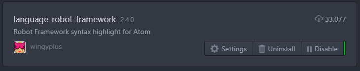
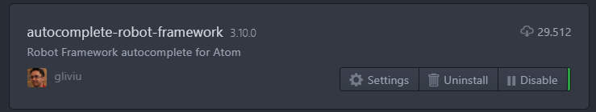
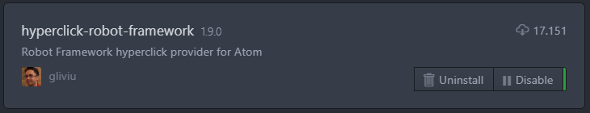
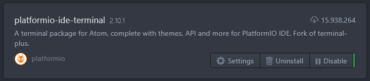
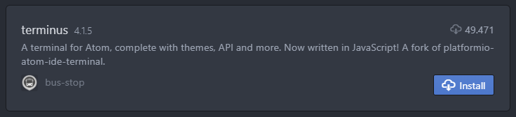

# Atom Setup for Robot Framework

  </a>

</h1>

<h4 align="center">My personal <a href="https://atom.io/" target="_blank">Atom</a> setup for using <a href="http://robotframework.org/" target="_blank">Robot Framework</a>.</h4>

  <a href="#key-features">Key Features</a> •
  <a href="#download">Download</a> •
  <a href="#how-to-use">How To Use</a> •
  <a href="#credits">Credits</a> •
  <a href="#license">License</a>

## Key Features

* Adds syntax highlighting and snippets to Robot Framework files in Atom
* Opening a robot file will scan the parent project for keywords that will later be available as suggestions
* Hold Ctrl while hovering the mouse or use 'ctrl-alt-enter' (windows & linux) to highlight keywords and open the definition
* Run your tests using shortcuts

## Download

##### language-robot-framework

##### autocomplete-robot-framework

##### hyperclick-robot-framework

##### platformio-ide-terminal

##### terminus

## Support

<!-- ## You may also like...

- [Text](https://github.com/text) - Text -->

## License

MIT

---

> [ludovicobesana.com](https://www.ludovicobesana.com) &nbsp;&middot;&nbsp;
> GitHub [@ludovicobesana](https://github.com/ludovicobesana) &nbsp;&middot;&nbsp;
> Twitter [@ludovicobesana](https://twitter.com/ludovicobesana)
