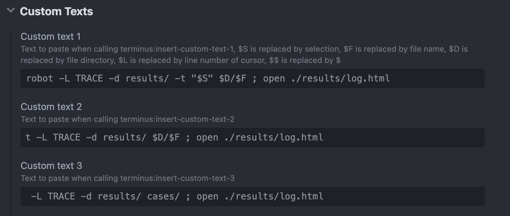
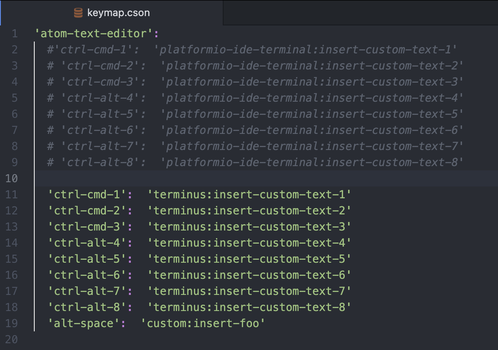

<div align="center">

# Atom Setup for Robot Framework

  </a>

</div>
</h1>

<h4 align="center">My personal <a href="https://atom.io/" target="_blank">Atom</a> setup for using <a href="http://robotframework.org/" target="_blank">Robot Framework</a>.</h4>

</p>

<p align="center">
  <a href="#key-features">Key Features</a> •
  <a href="#download">Download</a> •
  <a href="#how-to-use">How To Use</a> •
  <a href="#license">License</a>
</p>

## Key Features

* Adds syntax highlighting and snippets to Robot Framework files in Atom
* Opening a robot file will scan the parent project for keywords that will later be available as suggestions
* Hold Ctrl while hovering the mouse or use 'ctrl-alt-enter' (windows & linux) to highlight keywords and open the definition
* Run your tests using shortcuts

## Download

##### language-robot-framework

<a href="https://atom.io/packages/language-robot-framework"></a>

##### autocomplete-robot-framework

<a href="https://atom.io/packages/autocomplete-robot-framework"></a>

##### hyperclick-robot-framework

<a href="https://atom.io/packages/hyperclick-robot-framework"></a>

##### platformio-ide-terminal

<a href="https://atom.io/packages/platformio-ide-terminal"></a>

##### terminus

<a href="https://atom.io/packages/terminus"></a>

## How To Use

Once the packages has been downloaded, all you have to do is activate it from:

*Settings > Packages*

Windows/Linux

```
ctrl + , 
``` 

MacOS:

```
command + , 
``` 

##### platformio / terminus

To make the most of these packages, you need to configure them via the package settings.

First of all, access the package settings accessible from the Atom "Packages" section.

Once this is done enter the following values in the "Custom Text" section:




###### Custom Text 1

```
robot -L TRACE -d results/ -t "$S" $D/$F ; open ./results/log.html 
``` 

###### Custom Text 2

```
robot -L TRACE -d results/ $D/$F ; open ./results/log.html 
``` 

###### Custom Text 3

```
robot -L TRACE -d results/ cases/ ; open ./results/log.html 
``` 

If you work with Windows remember to replace **start** instead of "open"

As a second point, access the Atom keymaps and insert these configurations into it.

*Atom > Keymap*




###### platformio 

```
'atom-text-editor':
  'ctrl-cmd-1':  'platformio-ide-terminal:insert-custom-text-1'
  'ctrl-cmd-2':  'platformio-ide-terminal:insert-custom-text-2'
  'ctrl-cmd-3':  'platformio-ide-terminal:insert-custom-text-3'
``` 

###### terminus

```
'atom-text-editor':
  'ctrl-cmd-1':  'terminus:insert-custom-text-1'
  'ctrl-cmd-2':  'terminus:insert-custom-text-2'
  'ctrl-cmd-3':  'terminus:insert-custom-text-3'
```  

<!-- ## You may also like...

- [Text](https://github.com/text) - Text -->

## License

MIT

---

> [ludovicobesana.com](https://www.ludovicobesana.com) &nbsp;&middot;&nbsp;
> GitHub [@ludovicobesana](https://github.com/ludovicobesana) &nbsp;&middot;&nbsp;
> Twitter [@ludovicobesana](https://twitter.com/ludovicobesana)
